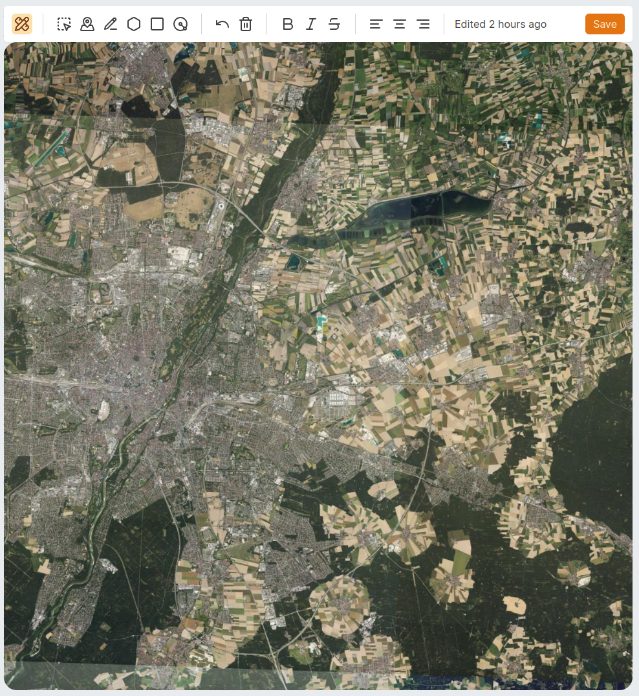

# ElectraType Agora

**Agora** is an open-core frontend to a land and farm management tool which uses [Directus](https://github.com/directus/directus) with [PostGIS](https://github.com/postgis/postgis) as a backend end to manage land assets and provide land management functionalities.

User interface is built using Svelte and [Melt UI](https://melt-ui.com/).

This project is currently under active development and in no way, shape or form stable and ment for production use.

## Screenshots

